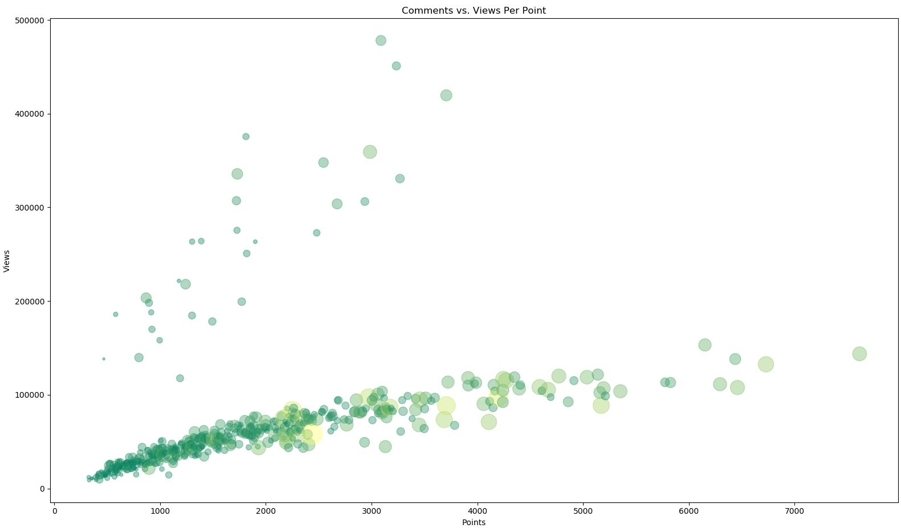
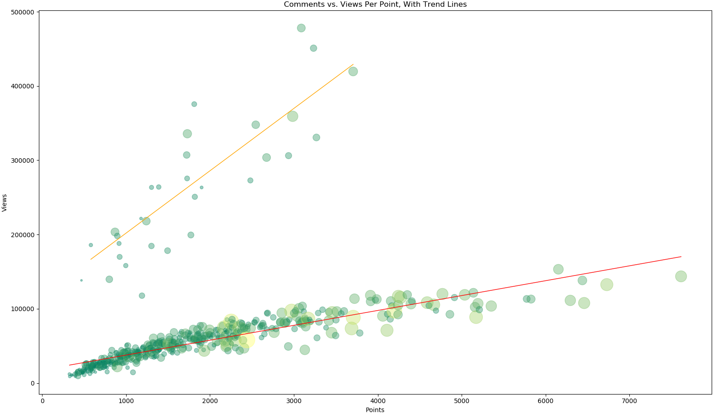
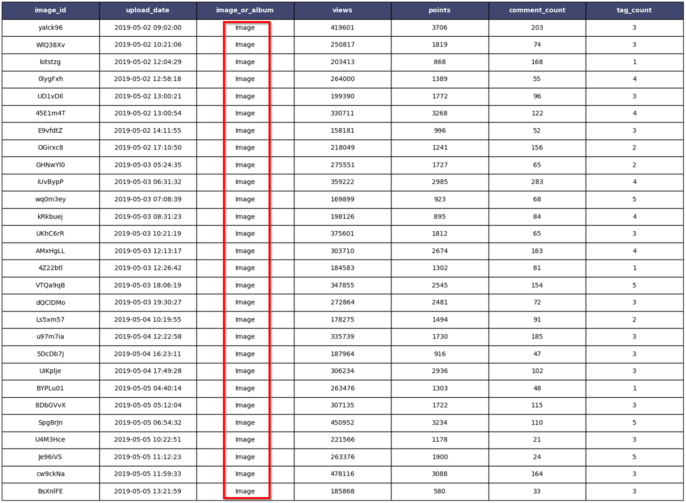
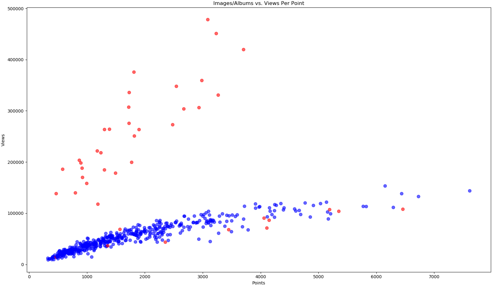

## Analysis of Imgur Gallery Images

### Summary

This is an analysis of the meta data for 525 images found in the Imgur gallery between 5/2/2019 and 5/4/2019. The data was obtained using Python scripts calling the Imgur API. The analysis goes through a few iterations to identify a pattern in the data and come up with a recommendation.

### The Technical Part

Imgur provides an open API to access its data and automate some tasks. For this exercise, I have used the data extraction functions for the gallery, the images, the albums and the tags. The data is stored locally in text files.

From the data file, I used common Python libraries (*matplotlib*, *numpy* and *pandas*) to graph and analyze the data. *matplotlib* was used to create all the figures below. *numpy* was used to calculate the trends. *pandas* was used for sorting, merging and deduping the data.

`imgur_extract_gallery.py`: this script extracts the image data from the Imgur gallery, retrieves the tags for the images and albums, and stores images and tags to files.

`imgur_tagcount_full.py`: this script counts the tags for each image, adds the counts to the image data, and stores the result into a new file.

`imgur_plot<x>.py`: the 4 plotting scripts are used to create, format and display the graphs.

### Data Analysis

The Imgur API makes several data points available for each image of the gallery. For this analysis, I retrieved the following data:

​		`image ID`		`image title`		`album or image`		`view count`		`tag count`

​		`up votes`		`down votes`		`points`		`comment count`		`upload date`

The scenario I will use is the following: assuming that most of Imgur revenue comes from displaying ads on the images, it stands to reason that increasing the view count of images will result in increased revenue. Let's see if we can find a pattern in the data that will help with that effort.

Because we are interested in the view count, it makes sense to start by looking at the relationship between views and other data points. For example: views per comment count, views per tag count, views per length of the title, etc.

Fast forwarding this process a bit, the graph of views per point seems to show an interesting pattern (figure 1) . The combination of size and color represents the number of comments for this image.

There are two clusters of data, and we should try to discover what this represents.

*Figure 1*

The count of views increases over time, and images that were uploaded more recently will have fewer views than images uploaded a longer time ago. However, I am making the assumption that the ratio of views per point will remain constant for a given image, because this is an intrinsic value tied to the image itself. I call this ratio the "<u>reaction score</u>" of an image.

In order to highlight this ratio, let's add trend lines on the two data clusters (figure 2).

*Figure 2*

The values are tightly packed around the trend line in the bottom cluster, showing the reaction score remains fairly constant for these images. The upper cluster also follows the trend, but is less defined.

But one thing is clear: the images in the upper cluster are getting more views, regardless of the points, and therefore produce more ad revenue.

Let's try to find what the images in the upper cluster have in common. The number of values is small enough that it is possible to put the data in a table and do a visual inspection. The table in figure 3 shows what the data looks like.

*Figure 3*

The images displayed on the Imgur gallery can be either "image" or "album". In the case of an album, the image that is displayed is the cover image of the album.

A quick look at the table shows that all the images in the upper cluster are listed as "image", which I highlighted in red. That is interesting, and it gives us a data point to focus on.

Let's go back to the original graph, but this time the color of each data element will distinguish between image and album (figure 4). Blue is album, red is image.

*Figure 4*

Boom! That is pretty clear cut: all the images in the upper cluster are "image", while there are only a handful in the lower cluster.

Putting some numbers on this:	

|                   | Images | Total Values | % of Images |
| ----------------- | :----: | :----------: | :---------: |
| **Upper Cluster** |   31   |      31      |    100%     |
| **Lower Cluster** |   11   |     494      |    2.2%     |

### Recommendation

The Imgur gallery images marked as "image" are getting more views than those marked as "album". This also means those images are generating more ad revenue.

Interestingly, the vast majority of albums contain a single image. This is likely to be the result of a default value in a field somewhere, possibly in the Imgur mobile app. The user may not intend to upload an album, and creates an album with a single image.

It is not clear why "image" uploads are getting more views, but they are. A more in-depth analysis performed by Imgur might be able to determine the reason for this.

However, it seems a quick win might be as simple as finding where the uploads are being set as "album", and make sure single-image albums are recorded as "image".

